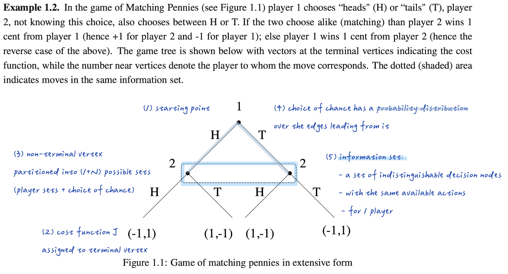
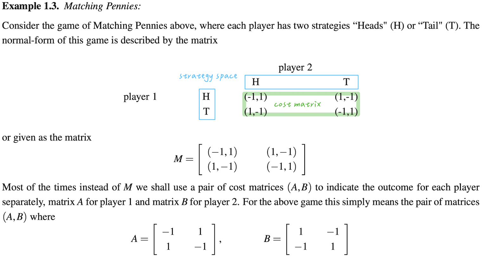

## Chapter 1 The Name of the Game

### 1 Terminology & Notation 

- **Game** $\mathcal{G}$

- **Players** $\mathcal{N}
=\{1,...,N\}$ 

- **Action sets** $\Omega_i$ for player $i$
    - finite → matrix game
    - infinite → continuous-action game
- **Strategy space**  $\displaystyle \Omega = \prod_{i\in\mathcal N}\Omega_i$
    - Pure strategy: $u_i \in \Omega_i$ (action = strategy in normal-form)
    - Mixed strategy: probability distribution $\mathbf{x}_i$ over $\Omega_i$
    - Strategy profile: $\mathbf{u} = (u_1,\ldots,u_N) \in \Omega$

- **Cost function** $J_i: \Omega \to \mathbb{R}$ depends on all players' actions: $$J_i(\mathbf{u}) = J_i(\mathbf{u}_i, \mathbf{u}_{-i})$$

### 2 Game Forms
The **extensive form** shows structure; the **normal form** summarizes into cost mappings.

#### 2.1 Extensive Form
Tree graph with nodes (game states) and edges (possible moves).

- Terminal nodes with cost function
- Non-terminal nodes partitioned by player:
    - $\mathscr{S}^0$: chance nodes (Nature)
    - $\mathscr{S}^i$: nodes where player $i \in \mathcal{N}$ moves

#### 2.2 Normal Form
Condensed Table with strategy spaces and cost functions.

In this case, 

- Strategy spaces: $$\begin{aligned}\Omega_1 = \Omega_2 &= \{H,T\}, \\ \Omega = \Omega_1 \times \Omega_2&= \{(H,H), (H,T), (T,H), (T,T)\}\end{aligned}$$

- Cost functions:$$J_1(\mathbf{u}_1, \mathbf{u}_2) = \mathbf{u}_1^{\!\top}A\mathbf{u}_2, \quad J_2(\mathbf{u}_1, \mathbf{u}_2) = \mathbf{u}_1^{\!\top}B\mathbf{u}_2$$
    where 
    - $\mathbf{u}_i = (1, 0)^{\top}$ represents playing $H$
    - $\mathbf{u}_i = (0, 1)^{\top}$ represents playing $T$

### 3. Game Features

#### 3.1 Competitive Nature

- **Cooperative Games**: Players cooperate with identical costs

- **Non-Cooperative Games**
    - **Coordination Games**: What benefits one benefits all (e.g., Stag Hunt)
    - **Constant-Sum Games**: Payoffs sum to fixed value (e.g., Rock-Paper-Scissors)  
    - **Conflicting Interest Games**: Opposing interests with compromise potential (e.g., Prisoner's Dilemma)

#### 3.2 Repetition

- **One-Shot Games**: Single round only

- **Repeated Games**: Same game, multiple rounds
    - Players adapt through learning
    - Can be **finite** (fixed number of time) or **infinite** horizon (repeated indefinitely)

- **Dynamic Games**: Different games across rounds. (e.g. Stochastic games, Markov games)

#### 3.3 Knowledge Information

Knowledge determines strategy space: more information enables better decisions.

| Information Type | Definition |
|-----------------|------------|
| **Complete** | All players' payoffs and strategies known |
| **Incomplete** | Payoffs/strategies partially unknown |
| **Perfect** | All past actions observable |
| **Imperfect** | Past actions partially observable |

### 4. Solution Concepts

#### 4.1 Minimax Solution

Minimize maximum expected loss: $\min_{\mathbf{u}_i} \max_{\mathbf{u}_{-i}} J_i(\mathbf{u})$

#### 4.2 Best Response (BR)
Choose strategy minimizing cost given opponents' strategies.

- **Limitations**:
    1. Beliefs about opponents may be incorrect
    2. Suboptimal in repeated games

- **Best Response Dynamics**: update rule where next-round strategies are best responses to current strategies.

#### 4.3 Nash Equilibrium

No player benefits from unilateral deviation: 
$$J_i(\mathbf{u}^*_i, \mathbf{u}^*_{-i}) \leq J_i(\mathbf{u}_i, \mathbf{u}^*_{-i}) \quad \forall i, \forall \mathbf{u}_i$$

#### 4.4 Pareto Optimality

No player improves without harming another.

**Pareto Dominated**:
- **Strictly**: $\mathbf{u}^*$ is strictly Pareto dominated if $\exists \mathbf{u} \in \Omega$ where $J_i(\mathbf{u}) < J_i(\mathbf{u}^*)$ for all $i$
- **Weakly**: $\mathbf{u}^*$ is weakly Pareto dominated if $\exists \mathbf{u} \in \Omega$ where $J_i(\mathbf{u}) \leq J_i(\mathbf{u}^*)$ for all $i$ (with at least one strict inequality)

**Pareto Efficient**:
- **Weakly**: Not **strictly** Pareto dominated
- **Strictly**: Not **weakly** Pareto dominated

### Reference

- Pavel, L. (2025). *Game Theory and Evolutionary Games*. Systems Control Group, Department of Electrical and Computer Engineering, University of Toronto.
