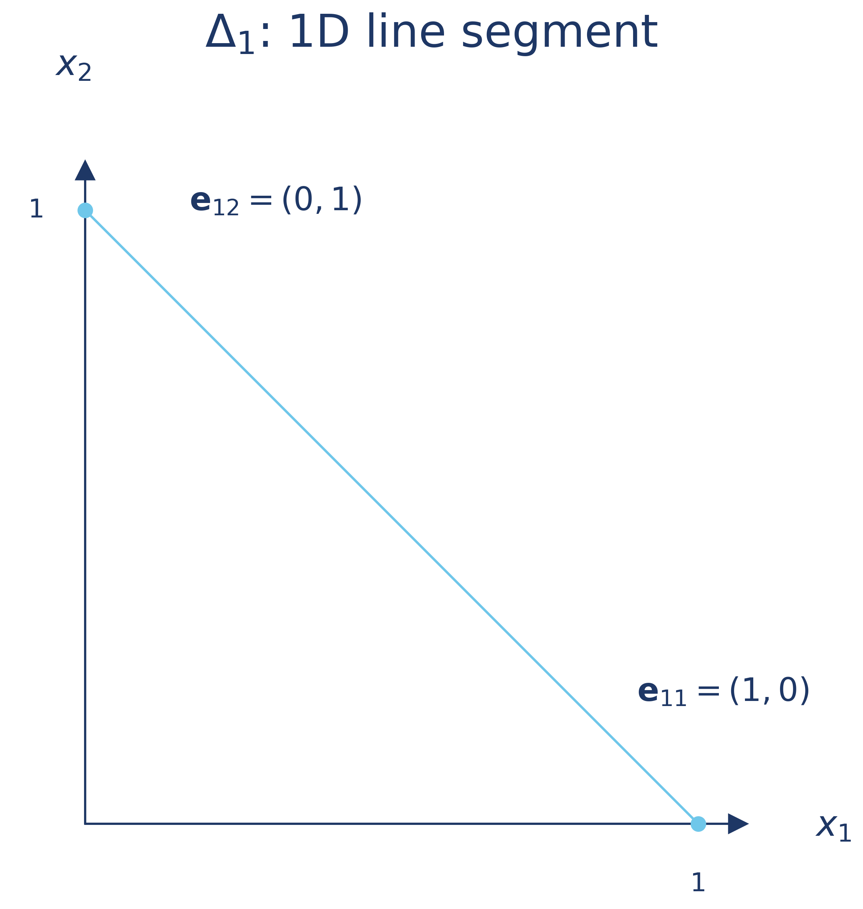
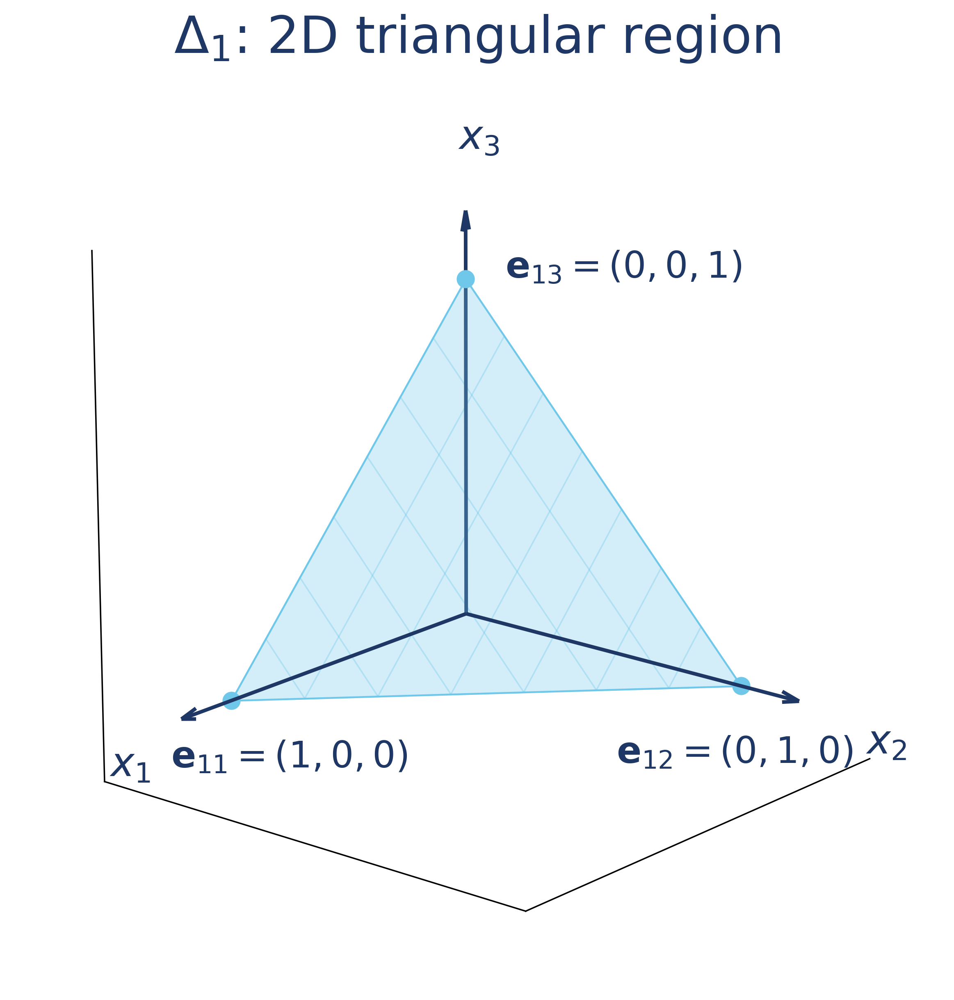
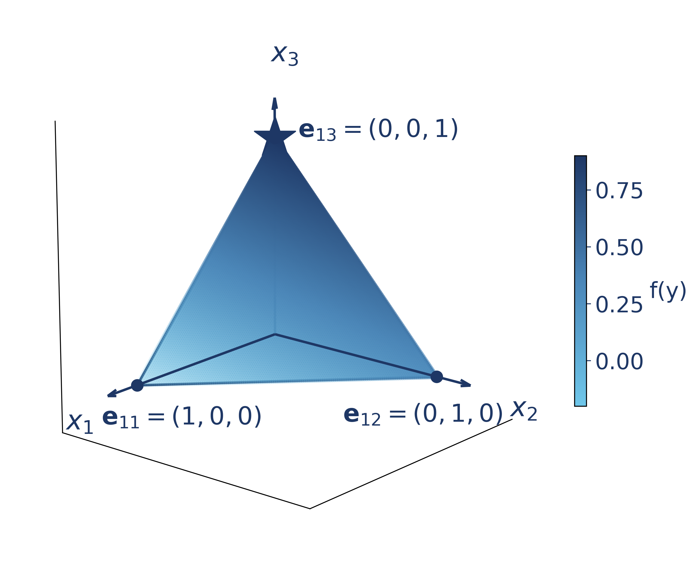
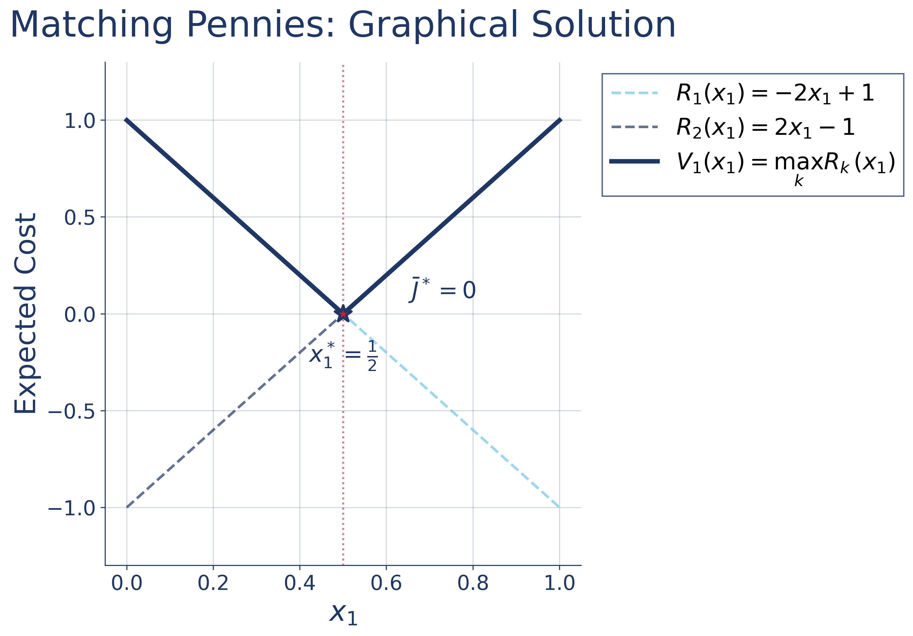

## Chapter 2: 2-Player Zero-Sum Finite/Matrix Games

### 2.1 Zero-Sum + Pure Strategy + Finite Actions

#### 2.1.1 Setup
First, let's review the concept of **Finite Actions & Pure Strategy**

- **Finite actions**: Allows matrix representation of the cost, and the size of the strategy space is:
  $$|\Omega_i| = m_i < \infty, \qquad A \in \mathbb{R}^{m_1 \times m_2}$$

- **Pure strategy**: Deterministic action. The player picks one specific action with certainty without a probability distribution. 
  $$\mathbf{u}_i \in \Omega_i$$
  
  For player $i$, its pure strategy $j$ is encoded as the **standard basis vector**:
  $$\mathbf{u}_i = \mathbf{e}_{ij} = \begin{bmatrix} 0 \\ \vdots \\ 1 \ \text{(j-th)} \\ \vdots \\ 0 \end{bmatrix} \in \mathbb{R}^{m_i}$$

Given the two concepts, we are introducing a new definition:

- **Zero-sum game**: 

  $$J_1(\mathbf{u}_1, \mathbf{u}_2) + J_2(\mathbf{u}_1, \mathbf{u}_2) = 0, \qquad \forall\,(\mathbf{u}_1, \mathbf{u}_2) \in \Omega_1 \times \Omega_2$$
  
  Therefore, the costs are negatives of each other: 
  $$J = J_1 = -J_2$$

  Given **finite actions**, we can express the cost function as 
  $$J(\mathbf{u}_1, \mathbf{u}_2) = \mathbf{u}_1^\top A\,\mathbf{u}_2$$

  where $P_1$'s cost matrix $A \in \mathbb{R}^{m_1 \times m_2}$, and $P_2$'s cost matrix $B=-A$

To sum up, we can specify the normal form under the zero-sum condition as

$$\mathcal{G}(\mathcal{N}, \Omega_i, J_i) \to \mathcal{G}(\mathcal{N}, \Omega_i, J)$$

- **Players**  $\mathcal{N}=\{1,2\}$ (players $P_1, P_2$).

- **Action sets (finite)**  $|\Omega_i|=m_i<\infty$.

  Define the index set of actions for player $i$ as  
  $$
  M_i = \{1,2,\dots,m_i\}.
  $$
  If we encode pure actions as one-hot vectors indexed by $M_i$, then
  $$
  \Omega_i=\{\mathbf e_{i1},\dots,\mathbf e_{i m_i}\}\subset\mathbb R^{m_i},
  \\
  \mathbf e_{ij}=\text{the $j$-th standard basis vector in }\mathbb R^{m_i}.
  $$

- **Costs (matrix form)**:  
  For pure actions $(j,k)$, where 
  - player $P_1$ chooses the $j$-th action ($j \in M_1$) 
  - player $P_2$ chooses the $k$-th action ($k \in M_2$)
  
  We can express the cost function as
  $$
  \begin{aligned}
  J(\mathbf u_1,\mathbf u_2)
  &= \mathbf u_1^{\!\top} A\,\mathbf u_2\\
  &= (\mathbf e_{1j})^\top A\,\mathbf e_{2k}\\
  &= [A]_{j,k}\\
  &= a_{jk}
  \end{aligned}
  $$
  
  This setting is also called a **matrix game**, since finite actions allow the game to be represented by a payoff matrix.

#### 2.1.2 Definition

After setting up the game, we define three solution concepts for 2PZSG. This is how we “play” the game.

1. security strategy
    - $P_1$ (row player, minimizer) chooses a **security strategy** that minimizes his worst-case loss:
      $$
      j^* \in \arg\min_{j\in M_1}\ \max_{k\in M_2} a_{jk},
      $$
      and $P_1$'s security level (upper value, ceiling) is

      $$J_U := \min_{j\in M_1}\max_{k\in M_2} a_{jk}
      = \min_{j\in M_1}\max_{k\in M_2} \mathbf e_{1j}^{\!\top}A\,\mathbf e_{2k}
      $$
    - $P_2$ (column player, maximizer) chooses a **security strategy** that maximizes his worst-case gain:
      $$
      k^* \in \arg\max_{k\in M_2}\ \min_{j\in M_1} a_{jk},
      $$
      and $P_2$'s security level (lower value, floor) is
      $$
      J_L := \max_{k\in M_2}\min_{j\in M_1} a_{jk}
      = \max_{k\in M_2}\min_{j\in M_1} \mathbf e_{1j}^{\!\top}A\,\mathbf e_{2k}
      $$
    - **Property:** In any matrix game, $J_L \le J_U$. 

2. minimax solution

    We’ll call $(j^*,k^*)\in M_1\times M_2$ a **minimax (security) pair** if each component is a security strategy as above.  

    ⚠️ In pure strategies this pair **need not be an equilibrium**: after seeing the other’s move, a player may have a better response (ex-post regret). 

    This happens whenever $J_L<J_U$ 

3. saddle point solution

    A pair $(j^*,k^*)$ is a **saddle point** iff
    $$
    a_{j^*k}\ \le\ a_{j^*k^*}\ \le\ a_{jk^*}\quad \forall j\in M_1,\ \forall k\in M_2.
    $$
    Then the **saddle-point value** is
    $$
    J^* = a_{j^*k^*}
    $$
    This entry is simultaneously **min in its column** (no regret for $P_1$) and **max in its row** (no regret for $P_2$). 

#### 2.1.3 Example
One example of 2PZSG is Matching Pennies, where each player has two strategies $\Omega_i=\{H,T\}$, and if both choose the same action, $P_2$ gives $P_1$ \$1, and $P_1$ gives $P_2$ \$1 otherwise.

Summarizing the rules into the strategy space $\Omega=\Omega_1 \times\Omega_2$: $$M = \begin{bmatrix} (-1,1) & (1,-1) \\ (1,-1) & (-1,1) \end{bmatrix}$$ and we use $P_1$'s cost matrix to analyze the game: $$A = \begin{bmatrix} -1 & 1 \\ 1 & -1 \end{bmatrix}$$ 

1. **Security Strategy**
    - for row player $P_1$, $J_U := \min_{j}\max_{k} a_{jk}$
      $$
      \begin{aligned}
      &\max_{k} a_{1k} = 1 \quad (k=2),\\
      &\max_{k} a_{2k} = 1 \quad (k=1),\\
      \Rightarrow\; &J_U = \min\{1,1\}=1.
      \end{aligned}
      $$
      $P_1$'s security strategy: $j^*\in\{1,2\}$ with upper value $J_U =1$

    - for column player $P_2$, $J_L := \max_{k} \min_{j} a_{jk}$
      $$
      \begin{aligned}
      &\min_{j} a_{j1} = -1 \quad (j=1),\\
      &\min_{j} a_{j2} = -1 \quad (j=2),\\
      \Rightarrow\; &J_L = \max\{-1,-1\}=-1.
      \end{aligned}
      $$
      $P_2$'s security strategy: $k^*\in\{1,2\}$ with lower value $J_L =-1$

      Since $J_L=-1<J_U=1$, **no saddle point** exists in pure strategies. All four combinations of security strategies form minimax pairs, but none of them is a saddle point solution. 
      
      This is in accordance with what we discussed about minimax solutions: **security strategies can be too conservative to be equilibria**.
      
2. **Regret Check for Equilibrium**

    To illustrate that minimax solutions aren't necessarily equilibria, let's check if players would regret their choices after observing opponent's action.

    From security strategies:
    - $j^*=\arg\min_{j}\{1,1\}\;\Rightarrow\; j^*\in\{1,2\}$
    - $k^*=\arg\max_{k}\{-1,-1\}\;\Rightarrow\; k^*\in\{1,2\}$

    Therefore, the security strategy pairs: $$\{(1,1),(1,2),(2,1),(2,2)\}$$

    **Check a candidate:** $(j^*,k^*)=(1,2)$

    - **$P_1$ regrets.** Given $P_2$ plays $k=2$, $P_1$ checks column 2:
      $$a_{12}=1 > a_{22}=-1$$
      $P_1$ could reduce cost from 1 to -1 by switching to row 2. 
      **Regret exists.**

    - **$P_2$ no regret.** Given $P_1$ plays $j=1$, $P_2$ checks row 1:
      $$a_{11}=-1 < a_{12}=1$$
      $P_2$ already maximizes $P_1$'s cost at column 2.
      **No regret.**

    Since $P_1$ has regret, $(1,2)$ is not an equilibrium.

In this example, we can observe

1. **Security strategies:** Both players have security strategies.
2. **Minimax pairs:** Any combination of security strategies $(j^*,k^*)$ forms a minimax (security) pair, but none is an equilibrium.  
3. **Saddle point:** None exists in pure strategies since no entry satisfies  

   $$a_{j^*k} \le a_{j^*k^*} \le a_{jk^*}\ \qquad \forall j,k$$

### 2.2 Mixed-Strategy

#### 2.2.1 Mixed-Strategy Extension
> **Question:** What if we want to solve for the equilibrium when no pure-strategy equilibrium exists?

💡 Aha! We introduce **randomization** over actions by replacing one-hot pure action vectors with **probability distributions** over the action sets.

**Notation**
- $x_j=\Pr(P_1 \text{ selects action } j)$, and $P_1$’s mixed strategy is
  $$
  x=[x_1,\ldots,x_{m_1}]^\top\in\mathbb R^{m_1}.
  $$
- $y_k=\Pr(P_2 \text{ selects action } k)$, and $P_2$’s mixed strategy is
  $$
  y=[y_1,\ldots,y_{m_2}]^\top\in\mathbb R^{m_2}.
  $$

For valid probability distributions, we require
$$
x\in\Delta_{1}:=\{\,x\in\mathbb R^{m_1}\mid x_j\ge 0,\ \sum_{j=1}^{m_1}x_j=1\,\},
$$
$$
y\in\Delta_{2}:=\{\,y\in\mathbb R^{m_2}\mid y_k\ge 0,\ \sum_{k=1}^{m_2}y_k=1\,\}.
$$

We sometimes denote $\Delta_X = \Delta_1 \times \Delta_2$ as the joint strategy space. (from the lecture note)

**Pure Strategies as Special Cases**

Pure strategies are special cases of mixed strategies. Any mixed strategy is some **convex combination** of these pure strategies. When a player selects action $j$ with probability $1$, the mixed strategy **degenerates to a pure strategy**:

- $P_1$: $x=\mathbf e_{1j}=[0,\ldots,1,\ldots,0]^\top$ ($1$ in $j$-th action)
- $P_2$: $y=\mathbf e_{2k}=[0,\ldots,1,\ldots,0]^\top$ ($1$ in $k$-th action) 

In geometry, they are the **vertices (extreme points)** of the probability simplex.

| **2D Example:** $P_1$ has 2 actions | **3D Example:** $P_1$ has 3 actions |
|:---:|:---:|
| $$\Delta_1 = \left\{\, x \in \mathbb{R}^2 \mid \begin{array}{l} 0 \le x_j \le 1, \  \\ \forall\ j = 1,2 \end{array} \,\sum_j x_j = 1\right\}$$ | $$\Delta_1 = \left\{\, x \in \mathbb{R}^3 \mid \begin{array}{l} 0 \le x_j \le 1, \  \\ \forall\ j = 1,2,3 \end{array} \,\sum_j x_j = 1\right\}$$ |
|  |  |

**Expected Cost**

When players use mixed strategies, the game outcome becomes probabilistic. The expected cost is computed by summing over all possible outcomes, weighted by their probabilities:

$$\begin{aligned}
\bar{J}(x,y) &= \mathbb{E}[J] \\
&= \sum_{j=1}^{m_1}\sum_{k=1}^{m_2} \text{(cost of outcome $(j,k)$)} \times \Pr(\text{outcome $(j,k)$ occurs}) \\
&= \sum_{j=1}^{m_1}\sum_{k=1}^{m_2}\ a_{jk} \cdot \ \ x_j \cdot y_k \\
&= \sum_{j=1}^{m_1} x_j \left(\sum_{k=1}^{m_2} a_{jk} \cdot y_k \right) \\
&= x^T A y
\end{aligned}$$

Properties of $\bar{J}(x,y) = x^T A y$:

1. **Maps mixed strategy profiles to expected costs:**
   $$\bar{J}: \Delta_1 \times \Delta_2 \to \mathbb{R}$$

2. **Is the kernel of the game:** 
   - $P_1$: $\min_{x \in \Delta_1} \bar{J}(x,y)$
   - $P_2$: $\max_{y \in \Delta_2} \bar{J}(x,y)$

3. **Preserves key properties:**
   - Bilinearity: Linear in each variable separately
   - Zero-sum: $\bar{J}_1(x,y) + \bar{J}_2(x,y) = 0$
   - Recovery: $\bar{J}(e_{1j}, e_{2k}) = a_{jk}$ for pure strategies

**Mixed strategy 2PZSG**

With **mixed strategies** and **expected cost** defined, we can extend the game notation:
- **Pure strategy game**: $$\mathcal{G}(\mathcal{N}, \Omega, J)$$ where players choose deterministic actions
- **Mixed strategy game**: $$\mathcal{G}(\mathcal{N}, \Delta_X, \bar{J})$$ where players choose probability distributions over actions

#### 2.2.2 Mixed Security Strategies

Next we are defining the security strategy for mixed strategy games.

| | $P_1$ | $P_2$ |
|:---:|:---:|:---:|
| **Security Strategy** | $$x^* \in \arg\min_{x \in \Delta_1} \max_{y \in \Delta_2} x^T A y$$ | $$y^* \in \arg\max_{y \in \Delta_2} \min_{x \in \Delta_1} x^T A y$$ |
| **Security Level** | $$\bar{J}_U = \min_{x \in \Delta_1} \max_{y \in \Delta_2} x^T A y$$ (upper value) | $$\bar{J}_L = \max_{y \in \Delta_2} \min_{x \in \Delta_1} x^T A y$$ (lower value) |

By extending to mixed strategies, we have:
$$J_L \leq \bar{J}_L \leq \bar{J}_U \leq J_U$$

Allowing mixed strategies enlarges each player’s feasible set, so the maximizer’s guaranteed **floor** weakly rises $$J_L \le \bar J_L$$ 
while the minimizer’s worst-case **ceiling** weakly falls  $$\bar J_U \le J_U$$

Therefore, the uncertainty interval shrinks from $[J_L,\,J_U]$ to $[\bar J_L,\,\bar J_U]$, which in finite zero-sum games collapses to a single value by minimax ($\bar J_L=\bar J_U$).

#### 2.2.3 Mixed-strategy saddle-point equilibrium

For a 2-player zero-sum matrix game with cost matrix $A=[a_{jk}]$, a pair 
$(x^*,y^*)\in\Delta_1\times\Delta_2$ is a **saddle-point equilibrium in mixed strategies** if

$$
x^{*\top}Ay \;\le\; x^{*\top}Ay^* \;\le\; x^{\top}Ay^*
\qquad
\left\{
\begin{array}{l}
\forall\,x\in\Delta_1,\\[2pt]
\forall\,y\in\Delta_2
\end{array}\right.
$$
The common value 
$$
\bar J := x^{*\top} A y^*
$$
is called the **saddle-point value** or the **value of the game in mixed strategies**.

**Properties:**
- Existence: always exists in finite 2P zero-sum games (by the Minimax Theorem).  
- Value: unique and equal to $\bar J = \bar J_U = \bar J_L$.  
- Strategies: equilibrium strategies $(x^*,y^*)$ may not be unique.  
- Stability: no player can unilaterally improve their outcome (no-regret condition).  

### 2.3 Minimax Theorem (von Neumann)

Minimax says that once we allow probability distributions (mixed strategies), a saddle-point equilibrium always exists in a 2-player zero-sum game:

$$
\min_{x \in \Delta_1} \max_{y \in \Delta_2} x^\top A y
= 
\max_{y \in \Delta_2} \min_{x \in \Delta_1} x^\top A y.
$$

#### 2.3.1 Establishing Bounds via Separating Hyperplane

To prove this, assume there exists a gap between the two values. The idea is to construct bounds:

- $P_1$ (minimizer) provides an upper bound
- $P_2$ (maximizer) a lower bound. 

This mirrors the separating hyperplane idea, formalized by Lemma 2.9.

> **Lemma 2.9 Separating Hyperplane**
>
> Let any arbitrary $m \times n$ matrix $Q$. Then either (i) or (ii) below must hold:
> 
> (i) $\;\exists\, y_0 \in \Delta_2$ such that
> $$x^\top Q y_0 \leq 0, \quad \forall x \in \Delta_1$$
> 
> (ii) $\;\exists\, x_0 \in \Delta_1$ such that
> $$x_0^\top Q y \geq 0, \quad \forall y \in \Delta_2$$
>
> **Interpretation:** for any matrix $Q$, either 
> there exists a mixed strategy $y_0$ for $P_2$ that makes $P_1$’s payoff negative, or there exists a mixed strategy $x_0$ for $P_1$ that guarantees positive payoff (but not both).

So in order to apply Lemma 2.9, we should create a shifted utility game where the "zero level" has been moved by $c$.
Therefore we construct a matrix 
$$Q = -A + c\mathbf{1}_{m_1 \times m_2}$$

**(i):** If $\exists\ y_0$ such that $x^\top Q y_0 \leq 0,\quad \forall x \in \Delta_1$:
$$\begin{aligned}
&x^\top(-A + c\mathbf{1}_{m_1\times m_2})y_0 \leq 0 \\
\Rightarrow \ &-x^\top A y_0 + c \leq 0 \\
\Rightarrow \ &x^\top A y_0 \geq c
\end{aligned}$$

Since this holds for all $x \in \Delta_1$, we can take the minimum over $x$:
$$\min_{x \in \Delta_1} x^\top A y_0 \geq c$$

Now, $y_0$ is one specific mixed strategy in $\Delta_2$ that achieves $\min_x x^\top A y_0 \geq c$.

The maximum over all possible $y \in \Delta_2$ must be at least as large as what $y_0$ achieves:
$$J_L = \max_{y \in \Delta_2} \min_{x \in \Delta_1} x^\top A y \geq \min_{x \in \Delta_1} x^\top A y_0 \geq c$$

Therefore: $$J_L \geq c$$

**(ii):** If $\exists\ x_0$ such that $x_0^\top Q y \geq 0,\quad \forall y \in \Delta_2$:
$$\begin{aligned}
&x_0^\top(-A + c\mathbf{1}_{m_1\times m_2})y \geq 0 \\
\Rightarrow \ &-x_0^\top A y + c \geq 0 \\
\Rightarrow \ &x_0^\top A y \leq c \quad \forall y \in \Delta_2
\end{aligned}$$

Since this holds for all $y \in \Delta_2$, we can take the maximum over $y$:
$$\max_{y \in \Delta_2} x_0^\top A y \leq c$$

Now, $x_0$ is one specific mixed strategy in $\Delta_1$ that achieves $\max_y x_0^\top A y \leq c$.

The minimum over all possible $x \in \Delta_1$ must be at most as large as what $x_0$ achieves:
$$J_U = \min_{x \in \Delta_1} \max_{y \in \Delta_2} x^\top A y \leq \max_{y \in \Delta_2} x_0^\top A y \leq c$$

Therefore: $$J_U \leq c$$

Thus Lemma 2.9 ensures either the $J_L\geq c$ or $J_U\leq c$.

#### 2.3.2 Eliminating the Gap by Contradiction

Let $J_L = \max_y \min_x x^\top A y$ and $J_U = \min_x \max_y x^\top A y$.

Assume $J_U > J_L$ (i.e., there exists a gap $k = J_U - J_L > 0$).

Choose $c = \frac{J_L + J_U}{2}$ (the midpoint).

By Lemma 2.9, either case (i) or case (ii) must hold:
- If (i) holds: $J_L \geq c = \frac{J_L + J_U}{2} = J_L + \frac{k}{2}$, which implies $0 \geq \frac{k}{2}$ — contradiction!
- If (ii) holds: $J_U \leq c = \frac{J_L + J_U}{2} = J_U - \frac{k}{2}$, which implies $0 \leq -\frac{k}{2}$ — contradiction!

Since both cases lead to contradictions, our assumption that $J_U > J_L$ must be false.

Therefore:
$$\min_x \max_y x^\top A y = \max_y \min_x x^\top A y$$

The Minimax Theorem is proved. 

### 2.4: Computing Mixed Saddle-Point Equilibrium Solution

#### 2.4.1 Dominated Strategies 

> TODO: summerise 2.4.1

The core idea is that you can remove strictly dominated rows/columns when computing Mixed-Strategy Equilibria

#### 2.4.2 Graphical Solution
> Appears in 3 out of 4 problems in problem set 2

**Geometric intuition:**

$P_1$ aims to minimize worst-case cost:
$$\min_{\mathbf{x}\in\Delta_1}\left\{\max_{\mathbf{y}\in\Delta_2}\bar{J}(\mathbf{x},\mathbf{y})\right\}$$

The strategy space $\Delta_2$ is a convex polytope with vertices $\{\mathbf{e}_2^1, \ldots, \mathbf{e}_2^{m_2}\}$. Any mixed strategy $\mathbf{y}$ is a convex combination of these vertices.

**Simplification:**

For fixed $\mathbf{x}$, the cost $\overline{J}(\mathbf{x}, \mathbf{y}) = \mathbf{x}^T A \mathbf{y}$ is linear in $\mathbf{y}$. Linear functions over convex polytopes achieve their maximum at vertices:

$$\max_{\mathbf{y} \in \Delta_2} \overline{J}(\mathbf{x}, \mathbf{y}) = \max_{k \in M_2} \mathbf{x}^T A \mathbf{e}_2^k$$

Therefore, $P_1$'s security strategy becomes:
$$\mathbf{x}^* = \arg\min_{\mathbf{x} \in \Delta_1} \max_{k \in M_2} \mathbf{x}^T A \mathbf{e}_2^k$$

For $2 \times n$ games, use $x_1 + x_2 = 1$ to parameterize $\mathbf{x} = [x_1, 1-x_1]^T$ with $x_1 \in [0,1]$.

Expected cost against $\mathbf{e}_2^k$:
$$R_k(x_1) = a_{1k}x_1 + a_{2k}(1-x_1) = (a_{1k} - a_{2k})x_1 + a_{2k}$$

Security level:
$$V_1(x_1) = \max_{k=1,...,n} R_k(x_1)$$

This is piecewise-linear (maximum of $n$ lines) and convex. The optimal $x_1^*$ minimizes $V_1(x_1)$.

**Example: Matching Pennies**

For $A = \begin{bmatrix} -1 & 1 \\ 1 & -1 \end{bmatrix}$:

Compute response lines:
$$\begin{aligned}
R_1(x_1) &= (-1 - 1)x_1 + 1 = -2x_1 + 1 \\
R_2(x_1) &= (1 - (-1))x_1 + (-1) = 2x_1 - 1
\end{aligned}$$

Find intersection:
$$-2x_1^* + 1 = 2x_1^* - 1 \implies 4x_1^* = 2 \implies x_1^* = \frac{1}{2}$$

Therefore $\mathbf{x}^* = [1/2, 1/2]^T$. By symmetry, $\mathbf{y}^* = [1/2, 1/2]^T$ with $\overline{J}^* = 0$.

#### 2.4.3 Linear Programming Formulation

> TODO: summerise 2.4.3

### Reference
- Pavel, L. (2025). *Game Theory and Evolutionary Games*. Systems Control Group, Department of Electrical and Computer Engineering, University of Toronto.
- https://en.wikipedia.org/wiki/Minimax_theorem